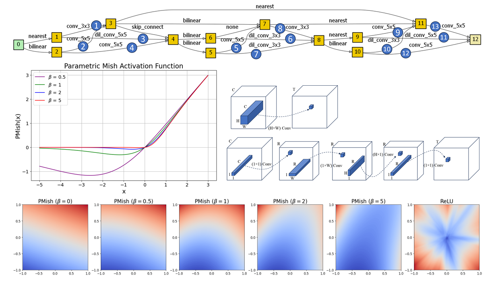

## Enhancing GANs with MMD Neural Architecture Search, PMish Activation Function, and Adaptive Rank Decomposition [[Paper]](https://ieeexplore.ieee.org/document/10732016) [[Code]](https://github.com/PrasannaPulakurthi/MMD-NAS-Plus) [[Website]](https://prasannapulakurthi.github.io/mmdpmishnas/) 

by [Prasanna Reddy Pulakurthi](https://prasannapulakurthi.com/), [Mahsa Mozaffari](https://mahsamozaffari.com/), [Sohail Dianat](https://www.rit.edu/directory/sadeee-sohail-dianat), [Jamison Heard](https://www.rit.edu/directory/jrheee-jamison-heard), [Raghuveer Rao](https://ieeexplore.ieee.org/author/37281258600), and [Majid Rabbani](https://www.rit.edu/directory/mxreee-majid-rabbani).

## Image Generation Results

| CIFAR-10 (32x32) | CelebA (64x64) |
| :---: | :---: |
|  <br>  |  |

| CIFAR100 (32x32) | STL-10 (48x48) |
| :---: | :---: |
|  |  |


**Overview of the Paper:** This research enhances Generative Adversarial Networks (GANs) by introducing a novel Parametric Mish (PMish) activation function, MMD-GAN repulsive loss incorporated neural architecture search strategy, and an adaptive rank decomposition method for network compression. The study improves GAN performance and stability with Modified MMD-GAN repulsive loss, demonstrating significant results on datasets like CIFAR-10, CIFAR-100, STL-10, and CelebA. Key contributions include the introduction of the PMish activation function, modified MMD-GAN rep loss, training strategy, and efficient model compression using ARD for deployment on resource-constrained devices.



## Parametric Mish (PMish) Activation Function
This is an implementation of the **PMish Activation** function using PyTorch. It combines the `Tanh` and `Softplus` functions with a learnable parameter, `beta`.

```python
import torch
import torch.nn as nn

class PMishActivation(nn.Module): 
    def __init__(self): 
        super(PMishActivation, self).__init__() 
        self.beta = nn.Parameter(torch.ones(1).type(torch.cuda.FloatTensor))  # Learnable parameter beta
        self.tanh_fn = nn.Tanh()
        self.softplus_fn = nn.Softplus()
        
    def forward(self, x): 
        return x * self.tanh_fn((1 / self.beta) * self.softplus_fn(self.beta * x))
```

| PMish | First-Order Derivative | Second-Order Derivative |
| :---: | :---: | :---: |
| |  |  |

## PMish Output Landscape
 

## Neural Architecture Search


## Training Strategy

| Small Upper Bound | Large Upper Bound | Increasing Upper Bound (Proposed) |
| :---: | :---: | :---: |
| |  |  |

## Citation
Please consider citing our paper in your publications if it helps your research. The following is a BibTeX reference.
```bibtex
@ARTICLE{10732016,
  author={Pulakurthi, Prasanna Reddy and Mozaffari, Mahsa and Dianat, Sohail and Heard, Jamison and Rao, Raghuveer and Rabbani, Majid},
  journal={IEEE Access}, 
  title={Enhancing GANs with MMD Neural Architecture Search, PMish Activation Function and Adaptive Rank Decomposition}, 
  year={2024},
  volume={},
  number={},
  pages={1-1},
  keywords={Generative adversarial networks;Training;Generators;Image coding;Acute respiratory distress syndrome;Tensors;Standards;Neural networks;Image synthesis;Adaptive systems;Activation Function;Generative Adversarial Network;Maximum Mean Discrepancy;Neural Architecture Search;Tensor Decomposition},
  doi={10.1109/ACCESS.2024.3485557}}
```

